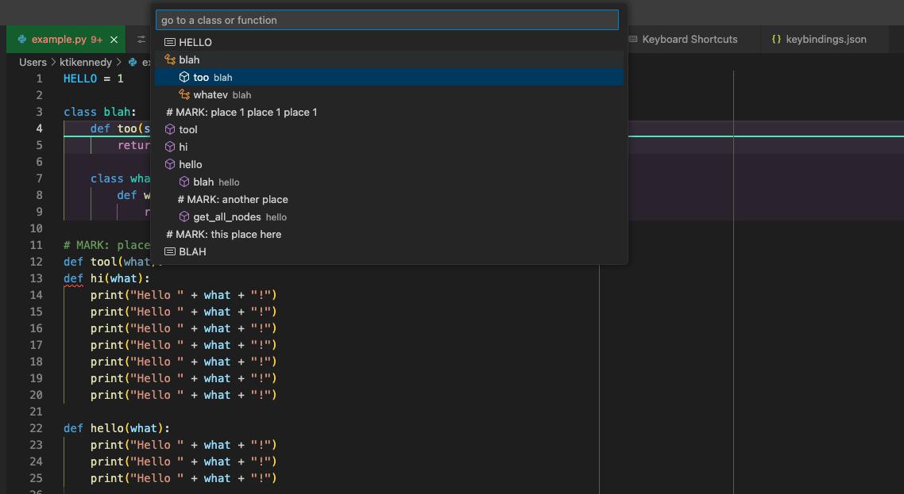

# Go To Class/Function ("Clunction")
The standard `Go to Symbol in File...` feature of [VS Code](https://github.com/Microsoft/vscode) can be noisy when you're only interested in functions. This extension adds a `Go to Clunction in File...` feature that allows you to focus only on the classes and functions declared in the file.

This is adapted from the [original by trinxnz](https://marketplace.visualstudio.com/items?itemName=trixnz.go-to-method)

## Installing
* Go to the extensions menu in vscode and search for "go to clunction"
* Install it

Alternatively, you can download the extension from the [marketplace](https://marketplace.visualstudio.com/items?itemName=KitKennedy.go-to-clunction).

## Usage
* Open the `Commands Palette` (Ctrl+Shift+P) and select `Go to Clunction in File...`
* Alternatively, bind a key to the command `workbench.action.gotoClunction`

*Note: No default keybinding is provided*

## License

This project is licensed under the MIT License - see the [LICENSE](LICENSE) file for details.

## Todo

- use regexes to parse python (in addition to current cpp/h files)
- Add more symbols to the list?

## Release Notes

### 0.0.5

- Better handling for symbol list quickview, looks better now
- Parse cpp/h files with regex rather than `vscode.executeDocumentSymbolProvider` command (which in practice seems to be pretty slow on cpp files for some reason) 
- Add option for display of constant values in quickview
- Add option for display of "MARK" comments in quickview

### 0.0.4

You're on your own, kid