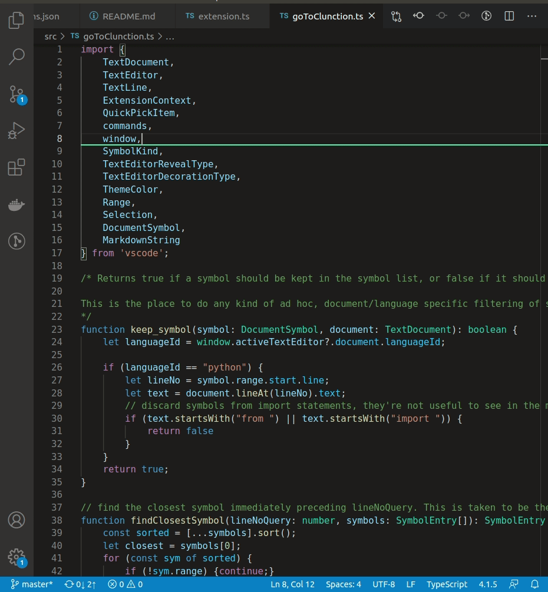

# Go To Class/Function ("Clunction")
The standard `Go to Symbol in File...` feature of [VS Code](https://github.com/Microsoft/vscode) can be noisy when you're only interested in functions. This extension adds a `Go to Clunction in File...` feature that allows you to focus only on the classes and functions declared in the file.

## Installing
* Launch VS Code Quick Open (Ctrl+P), paste the following command, and press enter:
* `ext install go-to-clunction`

Alternatively, you can download the extension from the [marketplace](https://marketplace.visualstudio.com/items?itemName=trixnz.go-to-method).

## Usage
* Open the `Commands Palette` (Ctrl+Shift+P) and select `Go to Clunction in File...`
* Alternatively, bind a key to the command `workbench.action.gotoClunction`

*Note: No default keybinding is provided*

## License

This project is licensed under the MIT License - see the [LICENSE](LICENSE) file for details.

## Todo

- figure out how to start at a certain place in the quick pick menu. It's annoying to start at the beginning of it every time